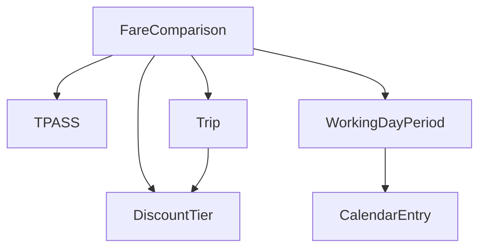

# Data Model: TPASS Calculator

**Date**: 2025-10-28
**Feature**: TPASS Calculator

## Core Entities

### 1. TPASS (Monthly Pass)

```typescript
interface TPASS {
  price: number;           // Fixed at 1200 NTD
  validityDays: number;    // Fixed at 30 days
  startDate: Date;         // User-selected start date
  endDate: Date;           // Calculated: startDate + 30 days
}
```

**Validation Rules**:
- `price` must be 1200 (constant)
- `validityDays` must be 30 (constant)
- `startDate` can be any date (past dates show warning)
- `endDate` is computed, not user-provided

### 2. Trip

```typescript
interface Trip {
  oneWayFare: number;      // Single journey fare in NTD
  tripsPerDay: number;     // Number of trips per working day
  totalTrips?: number;     // Calculated: workingDays * tripsPerDay
}
```

**Validation Rules**:
- `oneWayFare` must be positive number, default 40
- `tripsPerDay` must be positive integer, default 2
- `totalTrips` is computed, not user-provided

### 3. DiscountTier

```typescript
interface DiscountTier {
  minTrips: number;        // Minimum trips for this tier
  maxTrips: number | null; // Maximum trips (null for highest tier)
  discountRate: number;    // Discount percentage as decimal (0.05 = 5%)
}

const DISCOUNT_TIERS: DiscountTier[] = [
  { minTrips: 0,  maxTrips: 10, discountRate: 0.00 },
  { minTrips: 11, maxTrips: 20, discountRate: 0.05 },
  { minTrips: 21, maxTrips: 40, discountRate: 0.10 },
  { minTrips: 41, maxTrips: null, discountRate: 0.15 }
];
```

**Validation Rules**:
- Tiers must not overlap
- `discountRate` must be between 0 and 1
- Tiers are fixed for Taipei Metro system

### 4. CalendarEntry

```typescript
interface CalendarEntry {
  date: string;            // YYYY-MM-DD format
  isWorkingDay: boolean;   // True if government working day
  isHoliday: boolean;      // True if national holiday
  name?: string;           // Holiday name (optional)
  description?: string;    // Additional info (optional)
}
```

**Validation Rules**:
- `date` must be valid ISO date string
- `isWorkingDay` and `isHoliday` are usually opposite but not always (makeup workdays)
- Cached data used when API unavailable

### 5. WorkingDayPeriod

```typescript
interface WorkingDayPeriod {
  startDate: Date;
  endDate: Date;
  totalDays: number;       // Total calendar days
  workingDays: number;     // Number of working days
  holidays: number;        // Number of holidays/weekends
}
```

**Validation Rules**:
- `endDate` must be after `startDate`
- `totalDays` = `workingDays` + `holidays`
- Used for cross-month calculations

### 6. FareComparison

```typescript
interface FareComparison {
  // Input parameters
  startDate: Date;
  oneWayFare: number;
  tripsPerDay: number;

  // Calculated values
  period: WorkingDayPeriod;
  totalTrips: number;
  appliedDiscount: DiscountTier;

  // Cost comparison
  tpassCost: number;
  regularCost: number;
  regularCostBeforeDiscount: number;
  savingsAmount: number;
  savingsPercentage: number;

  // Recommendation
  recommendation: 'BUY_TPASS' | 'USE_REGULAR';
  recommendationReason: string;

  // Holiday details (NEW - addresses issue c)
  holidayDetails?: {
    totalHolidays: number;
    holidayList: Array<{
      date: string;          // YYYY-MM-DD
      name: string;          // Holiday name (e.g., "春節", "國慶日")
      dayOfWeek: string;     // Chinese day name (e.g., "一", "二")
      isWeekend: boolean;    // True if Sat/Sun
    }>;
    workingDayExceptions?: Array<{
      date: string;
      name: string;          // e.g., "補行上班"
      originalHoliday: string; // Which holiday it compensates
    }>;
  };

  // Warnings (e.g., past date, cache expired)
  warnings?: string[];
}
```

**Validation Rules**:
- All costs must be non-negative
- `savingsAmount` = `tpassCost` - `regularCost` (can be negative)
- `recommendation` based on which option costs less
- `holidayDetails` includes all holidays and makeup working days in the TPASS period
- Holiday list sorted by date ascending

## State Transitions

### Calculation Flow States

```typescript
type CalculationState =
  | 'IDLE'
  | 'VALIDATING_INPUT'
  | 'FETCHING_CALENDAR'
  | 'CALCULATING'
  | 'COMPLETE'
  | 'ERROR';
```

**State Transition Rules**:
1. `IDLE` → `VALIDATING_INPUT`: When user submits calculation request
2. `VALIDATING_INPUT` → `FETCHING_CALENDAR`: If input valid
3. `VALIDATING_INPUT` → `ERROR`: If input invalid
4. `FETCHING_CALENDAR` → `CALCULATING`: When calendar data ready
5. `FETCHING_CALENDAR` → `CALCULATING`: Using cached data on failure
6. `CALCULATING` → `COMPLETE`: Calculation successful
7. `CALCULATING` → `ERROR`: Calculation failed
8. Any state → `IDLE`: On reset

## Relationships

### Entity Relationships



**Relationship Rules**:
- One `FareComparison` references one `TPASS` configuration
- One `FareComparison` uses one `Trip` configuration
- `WorkingDayPeriod` aggregates multiple `CalendarEntry` records
- `Trip.totalTrips` determines which `DiscountTier` applies

## Data Constraints

### Business Rules

1. **Cross-Month Calculation**: When TPASS period spans multiple months, calculate each month's discount separately then combine proportionally
2. **Past Date Handling**: Allow calculations for past dates but display warning
3. **Calendar Fallback**: Use cached data when live data unavailable
4. **Default Values**:
   - One-way fare: NT$40
   - Trips per day: 2 (round trip)
   - Start date: Today
5. **Fixed Constants**:
   - TPASS price: NT$1,200
   - TPASS validity: 30 days
   - Discount tiers: 0%, 5%, 10%, 15%

### Data Integrity

1. All monetary values stored as integers (cents) to avoid floating point issues
2. Dates stored in ISO 8601 format (YYYY-MM-DD) for consistency
3. Boolean flags must be explicit (no null/undefined)
4. Computed fields marked as optional in interfaces

## Example Data

### Sample Calculation Input

```json
{
  "startDate": "2025-10-28",
  "oneWayFare": 40,
  "tripsPerDay": 2
}
```

### Sample Calculation Output

```json
{
  "startDate": "2025-10-28",
  "oneWayFare": 40,
  "tripsPerDay": 2,
  "period": {
    "startDate": "2025-10-28",
    "endDate": "2025-11-26",
    "totalDays": 30,
    "workingDays": 22,
    "holidays": 8
  },
  "totalTrips": 44,
  "appliedDiscount": {
    "minTrips": 41,
    "maxTrips": null,
    "discountRate": 0.15
  },
  "tpassCost": 1200,
  "regularCost": 1496,
  "regularCostBeforeDiscount": 1760,
  "savingsAmount": -296,
  "savingsPercentage": -19.79,
  "recommendation": "BUY_TPASS",
  "recommendationReason": "Save NT$296 with TPASS monthly pass"
}
```
### 7. CalendarCacheMetadata (NEW)

```typescript
interface CalendarCacheMetadata {
  version: string;          // Cache format version
  lastUpdated: string;      // ISO date when cache was updated
  source: string;           // Data source name
  yearsCovered: number[];   // List of years in cache (supports multi-year, issue b)
  expiryDays: number;       // Cache validity period in days (default: 30)
}
```

**Validation Rules**:
- `yearsCovered` must contain at least one year
- `yearsCovered` array sorted ascending
- Auto-fetch triggers when cache age > `expiryDays` (issue a)
- Multi-year support for TPASS periods crossing year boundaries (issue b)

**Example**:
```json
{
  "version": "1.0.0",
  "lastUpdated": "2025-10-28",
  "source": "data.gov.tw - 政府行政機關辦公日曆表",
  "yearsCovered": [2025, 2026],
  "expiryDays": 30
}
```

## Enhanced Response Format (Issue c)

### Holiday Details in Response

To address issue (c), all calculation responses now include detailed holiday information:

```typescript
{
  // ... standard fields ...
  "holidayDetails": {
    "totalHolidays": 3,
    "holidayList": [
      {
        "date": "2025-10-10",
        "name": "國慶日",
        "dayOfWeek": "五",
        "isWeekend": false
      },
      {
        "date": "2025-10-24",
        "name": "補假",
        "dayOfWeek": "五",
        "isWeekend": false
      },
      {
        "date": "2025-10-25",
        "name": "臺灣光復暨金門古寧頭大捷紀念日",
        "dayOfWeek": "六",
        "isWeekend": true
      }
    ],
    "workingDayExceptions": [
      {
        "date": "2025-10-18",
        "name": "補行上班",
        "originalHoliday": "2025-10-10 國慶日補假"
      }
    ]
  }
}
```

This provides users with:
- Complete list of holidays in the TPASS period
- Holiday names in Chinese
- Day of week information
- Identification of makeup working days
- Clear understanding of why working day count may differ from expectations
