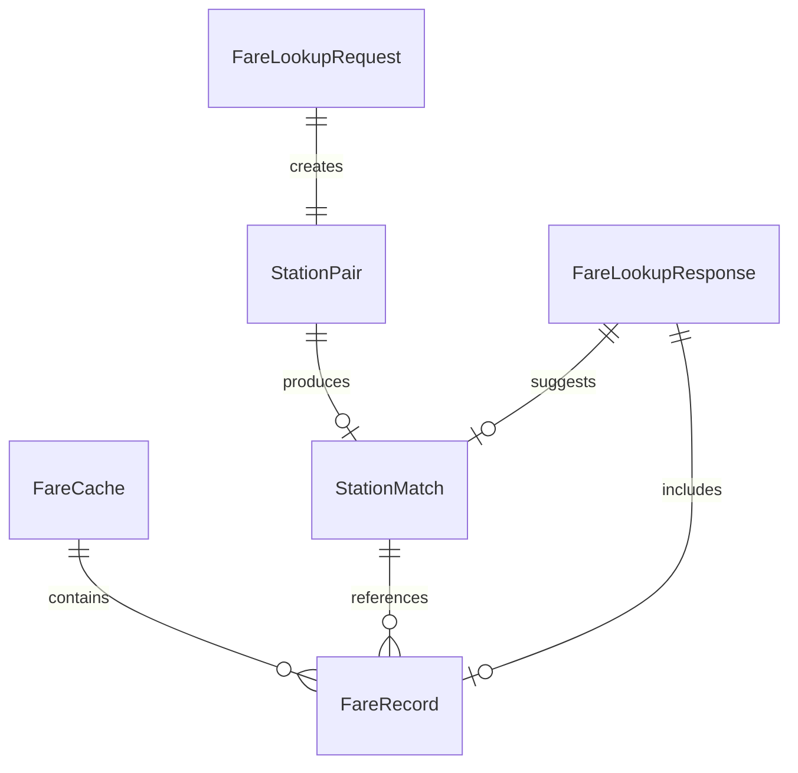

# Data Model: Taipei Metro Fare Lookup

**Feature**: 003-fare-lookup
**Date**: 2025-10-31
**Status**: Final

## Overview

Data structures for managing Taipei Metro fare information, including CSV parsing, caching, and fuzzy matching results.

## Core Entities

### 1. FareRecord

Represents a single fare entry between two stations from the CSV data.

```typescript
interface FareRecord {
  id: string;           // _id from CSV
  origin: string;       // 起站 (origin station name)
  destination: string;  // 訖站 (destination station name)
  regularFare: number;  // 全票票價 (regular fare in TWD)
  discountedFare: number; // 優惠票價 (discounted fare in TWD)
  distance: number;     // 距離 (distance in km)
}
```

**Constraints**:
- All fields required
- Fares must be positive numbers
- Station names in Traditional Chinese
- Distance in kilometers (decimal allowed)

### 2. StationPair

Key for fare lookup operations.

```typescript
interface StationPair {
  origin: string;
  destination: string;
  normalized?: {
    origin: string;      // Normalized for matching
    destination: string; // Normalized for matching
  };
}
```

**Normalization Rules**:
- Convert to Traditional Chinese
- Remove suffixes (站, 車站)
- Trim whitespace
- Lowercase for matching

### 3. FareCache

Persistent cache structure for fare data.

```typescript
interface FareCache {
  version: string;       // Cache format version (e.g., "1.0.0")
  source: string;        // Data source URL
  lastUpdated: string;   // ISO 8601 timestamp
  expiresAt: string;     // ISO 8601 timestamp (7 days from update)
  checksum?: string;     // Optional data integrity check
  stats: {
    totalRecords: number;
    uniqueStations: number;
    lastAccessed?: string;
  };
  data: FareRecord[];    // All fare records
}
```

**Cache Rules**:
- Expires 7 days after lastUpdated
- Atomic write to prevent corruption
- Validate on load (version, expiry)

### 4. StationMatch

Result from fuzzy matching operation.

```typescript
interface StationMatch {
  original: string;      // User input
  matches: Array<{
    station: string;     // Matched station name
    score: number;       // Match confidence (0-1)
    type: 'origin' | 'destination';
  }>;
  selected?: string;     // User's final selection
}
```

**Matching Rules**:
- Return top 3 matches
- Minimum score threshold: 0.3
- Sort by score descending

### 5. FareLookupRequest

Input parameters for fare lookup operation.

```typescript
interface FareLookupRequest {
  // Option 1: Direct fare input
  fare?: number;

  // Option 2: Station-based lookup
  origin?: string;
  destination?: string;

  // Common parameters
  fareType: 'regular' | 'discounted';
  allowFuzzyMatch: boolean;
}
```

**Validation**:
- Must provide either `fare` OR (`origin` AND `destination`)
- Default fareType: 'regular'
- Default allowFuzzyMatch: true

### 6. FareLookupResponse

Output from fare lookup operation.

```typescript
interface FareLookupResponse {
  success: boolean;
  fare?: number;
  fareType: 'regular' | 'discounted';
  source: 'manual' | 'cache' | 'network';

  // For station-based lookup
  stations?: {
    origin: string;
    destination: string;
  };

  // For fuzzy matching
  suggestions?: {
    origin?: StationMatch;
    destination?: StationMatch;
  };

  // Warnings
  warnings?: string[];  // e.g., "Using expired cache data"

  // Error details
  error?: {
    code: string;
    message: string;
  };
}
```

## Data Flow

### 1. CSV Import Flow

```
CSV File (Big5) → TextDecoder → Parse → FareRecord[] → Validate → Cache
```

### 2. Lookup Flow

```
User Input → Normalize → Search Cache → Fuzzy Match → Return Results
```

### 3. Cache Management Flow

```
Check Expiry → Valid? → Use Cache
           ↓
         Expired → Fetch New → Update Cache → Use New Data
                ↓
              Failed → Use Expired (with warning)
```

## Relationships



## State Transitions

### Cache States

```
EMPTY → LOADING → VALID → EXPIRED → UPDATING → VALID
                    ↓         ↓
                 CORRUPTED  FAILED
```

### Lookup States

```
IDLE → PROCESSING → SUCCESS
           ↓           ↓
     NEEDS_INPUT    WARNING
           ↓
        ERROR
```

## Indexing Strategy

For optimal performance:

1. **Primary Index**: `Map<string, FareRecord>`
   - Key: `${origin}|${destination}`
   - O(1) exact match lookup

2. **Station List**: `Set<string>`
   - All unique station names
   - For fuzzy matching pool

3. **Normalized Index**: `Map<string, string[]>`
   - Key: normalized station name
   - Value: original variations

## Data Validation Rules

### On Import
- Verify CSV headers match expected columns
- Validate numeric fields (fare, distance)
- Check for required fields
- Ensure positive fare amounts

### On Cache Load
- Check version compatibility
- Verify not expired
- Validate checksum if present
- Ensure data structure integrity

### On User Input
- Trim whitespace
- Validate fare range (1-999)
- Check station name length (1-50 chars)

## Error Codes

```typescript
enum FareErrorCode {
  // Network errors
  NETWORK_ERROR = 'E001',
  CSV_DOWNLOAD_FAILED = 'E002',

  // Data errors
  INVALID_CSV_FORMAT = 'E003',
  ENCODING_ERROR = 'E004',
  CACHE_CORRUPTED = 'E005',

  // Lookup errors
  STATIONS_NOT_FOUND = 'E006',
  NO_FARE_DATA = 'E007',
  INVALID_INPUT = 'E008',

  // Warnings (not errors)
  USING_EXPIRED_CACHE = 'W001',
  FUZZY_MATCH_USED = 'W002',
}
```

## Storage Estimates

- CSV file: ~200KB (2000 records)
- Parsed cache: ~300KB JSON
- Memory usage: ~1MB loaded
- Station index: ~10KB

## Future Considerations

For production (beyond PoC):
- Add database storage for scale
- Include route/line information
- Support transfer pricing
- Add fare history tracking
- Include special fare rules