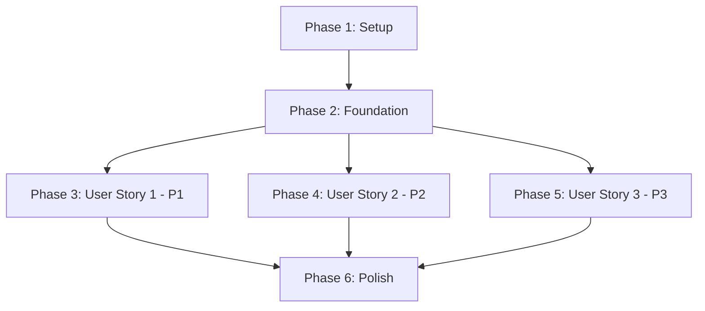

# Implementation Tasks: Taipei Metro Fare Lookup

**Feature**: 003-fare-lookup
**Branch**: `003-fare-lookup`
**Date**: 2025-10-31

## Overview

Implementation tasks organized by user story to enable independent, incremental delivery. Each user story phase can be implemented and tested independently.

**Total Tasks**: 29
**Parallelizable Tasks**: 15
**User Stories**: 3 (P1, P2, P3)

## MVP Recommendation

**Minimum Viable Product**: User Story 1 only (Manual Fare Input)
- Preserves backward compatibility
- Requires minimal changes to existing system
- Can be deployed independently
- Tasks: T001-T013A (13 tasks total: 4 setup + 5 foundation + 5 US1)

## Dependency Graph



**User Story Dependencies**:
- ✅ User Story 1 (P1): No dependencies - Can start after Foundation
- ✅ User Story 2 (P2): No dependencies - Can start after Foundation
- ⚠️ User Story 3 (P3): Soft dependency on US1 + US2 (uses both input methods)

**Parallel Execution**: US1 and US2 can be implemented in parallel after Foundation phase completes.

## Implementation Strategy

1. **Setup First**: Complete Phase 1 (project initialization)
2. **Foundation Second**: Complete Phase 2 (shared infrastructure)
3. **Incremental Delivery**: Implement user stories in priority order
   - US1 (P1) → Deploy MVP
   - US2 (P2) → Add station lookup
   - US3 (P3) → Add interactive choice
4. **Polish Last**: Cross-cutting concerns after core functionality

---

## Phase 1: Setup (Project Initialization)

**Goal**: Prepare development environment and install dependencies

**Duration Estimate**: 10-15 minutes

### Tasks

- [ ] T001 Install fuzzysort dependency via `bun add fuzzysort`
- [ ] T002 Create data directory structure `mkdir -p data`
- [ ] T003 Add fare configuration constants to src/config.ts
- [ ] T004 Create fare models directory and base types in src/models/fare.ts

---

## Phase 2: Foundation (Shared Infrastructure)

**Goal**: Build foundational services needed by all user stories

**Duration Estimate**: 2-3 hours

**Independent Test**: Foundation services can be tested independently via unit tests

### Tasks

- [ ] T005 [P] Implement CSV parser with Big5 encoding in src/lib/csvParser.ts
- [ ] T006 [P] Implement station name matcher with fuzzysort in src/lib/stationMatcher.ts
- [ ] T007 [P] Implement FareCacheService for cache management in src/services/fareCacheService.ts
- [ ] T008 Implement FareService core logic in src/services/fareService.ts
- [ ] T009 [P] Add fare CLI command structure in src/cli/fare-cmd.ts

**Parallel Execution Example**:
```bash
# These tasks can be worked on simultaneously
Task T005: Developer A implements CSV parser
Task T006: Developer B implements station matcher
Task T007: Developer C implements cache service
```

---

## Phase 3: User Story 1 - Manual Fare Input (P1)

**Story Goal**: Users can directly input fare amounts for monthly pass calculations, maintaining backward compatibility

**Why Independent**: This story only extends the existing MCP tool to accept fare input, requires no external data or fuzzy matching

**Independent Test Criteria**:
- ✅ User can call MCP tool with `{ fare: 30 }` and receive success response
- ✅ Manual fare input is validated (positive number, reasonable range)
- ✅ Fare is passed to existing monthly pass calculation
- ✅ No dependency on CSV data or station lookup

**Duration Estimate**: 1-2 hours

### Tasks

- [ ] T010 [US1] Extend FareLookupRequest interface to support manual fare in src/models/fare.ts
- [ ] T011 [US1] Implement manual fare validation in src/services/fareService.ts
- [ ] T012 [US1] Implement MCP tool handler logic for lookup-fare in src/adapters/mcp/tools/fareLookupTool.ts
- [ ] T013 [US1] Define Zod input/output schemas for MCP tool in src/adapters/mcp/tools/fareLookupTool.ts
- [ ] T013A [US1] Verify fare value is passed correctly to existing monthly pass calculation logic

**Acceptance Test**:
```typescript
// Manual test via MCP client
{
  "tool": "lookup-fare",
  "arguments": { "fare": 30, "fareType": "regular" }
}
// Expected: { success: true, fare: 30, source: "manual" }
```

---

## Phase 4: User Story 2 - Automatic Fare Lookup (P2)

**Story Goal**: Users can specify origin/destination stations to automatically retrieve fares from cached data

**Why Independent**: This story uses the foundation services (CSV, cache, fuzzy matching) but doesn't depend on US1 or US3

**Independent Test Criteria**:
- ✅ User can provide station pair and get fare from cache
- ✅ CSV data is downloaded and cached on first request
- ✅ Fuzzy matching returns top 3 suggestions for partial matches
- ✅ Cache expires after 7 days and refreshes automatically
- ✅ Graceful fallback to expired cache on network failure

**Duration Estimate**: 3-4 hours

### Tasks

- [ ] T014 [US2] Implement downloadFareData method in src/services/fareCacheService.ts
- [ ] T015 [US2] Implement cache validation and expiry logic in src/services/fareCacheService.ts
- [ ] T016 [US2] Implement station pair fare lookup in src/services/fareService.ts
- [ ] T017 [US2] Integrate fuzzy matching for station names in src/services/fareService.ts
- [ ] T018 [US2] Add station-based lookup to MCP tool in src/adapters/mcp/tools/fareLookupTool.ts
- [ ] T019 [US2] Implement network failure handling with expired cache fallback in src/services/fareCacheService.ts
- [ ] T020 [US2] Add fare:update CLI command in src/cli/fare-cmd.ts
- [ ] T021 [US2] Add fare:status CLI command in src/cli/fare-cmd.ts

**Parallel Execution Example**:
```bash
# Independent features within US2
Task T020: Developer A adds fare:update CLI
Task T021: Developer B adds fare:status CLI
# Meanwhile:
Task T014-T019: Core lookup logic (sequential)
```

**Acceptance Test**:
```typescript
// Station lookup via MCP client
{
  "tool": "lookup-fare",
  "arguments": {
    "origin": "台北車站",
    "destination": "市政府",
    "fareType": "regular"
  }
}
// Expected: { success: true, fare: 25, source: "cache", stations: {...} }

// Fuzzy matching test
{
  "tool": "lookup-fare",
  "arguments": { "origin": "北車", "destination": "市府" }
}
// Expected: { success: true, suggestions: { origin: [{...}], destination: [{...}] } }
```

---

## Phase 5: User Story 3 - Interactive Input Choice (P3)

**Story Goal**: When users don't provide fare info, system prompts for input method choice

**Why Depends on US1 + US2**: This story orchestrates both input methods, providing a menu to choose between manual fare (US1) or station lookup (US2)

**Independent Test Criteria**:
- ✅ When no fare/stations provided, system asks for input method
- ✅ User can select "manual" and proceed to US1 flow
- ✅ User can select "lookup" and proceed to US2 flow
- ✅ Interactive prompts guide new users through the process

**Duration Estimate**: 1-2 hours

### Tasks

- [ ] T022 [US3] Implement input method detection in src/services/fareService.ts
- [ ] T023 [US3] Add interactive prompt logic to MCP tool in src/adapters/mcp/tools/fareLookupTool.ts
- [ ] T024 [US3] Implement user choice routing between manual/station lookup

**Acceptance Test**:
```typescript
// No fare information provided
{
  "tool": "lookup-fare",
  "arguments": {}
}
// Expected: {
//   success: false,
//   promptUser: true,
//   message: "Please choose: (1) Enter fare manually, or (2) Provide station names"
// }
```

---

## Phase 6: Polish & Cross-Cutting Concerns

**Goal**: Final improvements, edge case handling, and cross-cutting features

**Duration Estimate**: 2-3 hours

### Tasks

- [ ] T025 Add comprehensive error messages and user guidance to all MCP tool responses
- [ ] T026 [P] Implement corrupted cache detection and recovery in src/services/fareCacheService.ts
- [ ] T027 [P] Add validation for non-existent station names with helpful error messages in src/services/fareService.ts
- [ ] T028 [P] Implement disambiguation logic for stations with similar spellings in src/lib/stationMatcher.ts

---

## Task Summary by Phase

| Phase | Tasks | Duration | Parallelizable |
|-------|-------|----------|----------------|
| 1: Setup | 4 | 15 min | 0 |
| 2: Foundation | 5 | 2-3 hr | 3 |
| 3: US1 (P1) | 5 | 1-2 hr | 0 |
| 4: US2 (P2) | 8 | 3-4 hr | 2 |
| 5: US3 (P3) | 3 | 1-2 hr | 0 |
| 6: Polish | 4 | 2-3 hr | 3 |
| **Total** | **29** | **9-15 hr** | **8** |

## Parallel Execution Opportunities

### Foundation Phase (Phase 2)
```bash
# 3 developers can work in parallel
Dev A: T005 (CSV parser)
Dev B: T006 (Station matcher)
Dev C: T007 (Cache service)
# Then all merge before T008
```

### User Story 2 (Phase 4)
```bash
# CLI commands independent from core logic
Dev A: T020, T021 (CLI commands)
Dev B: T014-T019 (Core lookup logic)
```

## Testing Strategy

**Manual Testing Only** (per PoC constitution):

1. **Foundation Phase**: Test each service independently
   - CSV parser: Download real CSV and verify parsing
   - Station matcher: Test fuzzy matching with sample names
   - Cache service: Test read/write/expiry

2. **User Story 1**: Test manual fare input via MCP client
   - Valid fare: Should succeed
   - Invalid fare: Should fail with error

3. **User Story 2**: Test station lookup
   - Exact match: Should return fare
   - Fuzzy match: Should return suggestions
   - Network failure: Should use expired cache

4. **User Story 3**: Test interactive prompts
   - No input: Should prompt for choice
   - Choice selection: Should route correctly

## File Path Reference

Quick reference for all files created/modified:

**Models**:
- `src/models/fare.ts` - All fare-related types

**Services**:
- `src/services/fareService.ts` - Core fare lookup logic
- `src/services/fareCacheService.ts` - Cache management

**Libraries**:
- `src/lib/csvParser.ts` - CSV parsing with Big5
- `src/lib/stationMatcher.ts` - Fuzzy matching

**Adapters**:
- `src/adapters/mcp/tools/fareLookupTool.ts` - MCP tool registration

**CLI**:
- `src/cli/fare-cmd.ts` - Fare management commands

**Configuration**:
- `src/config.ts` - Fare configuration constants

**Data**:
- `data/fare-cache.json` - Cached fare data (generated)

## Risk Mitigation

- **CSV Format Changes**: Validate CSV structure on each download (T014)
- **Encoding Issues**: Test Big5 handling with real data (T005)
- **Network Failures**: Implement retry and fallback (T019)
- **Cache Corruption**: Atomic writes and validation (T007)

## Next Steps After Completion

1. Monitor cache hit rates and expiry patterns
2. Collect user feedback on fuzzy matching accuracy
3. Consider adding station aliases for common abbreviations
4. Plan for OpenAI Apps adapter (future feature)