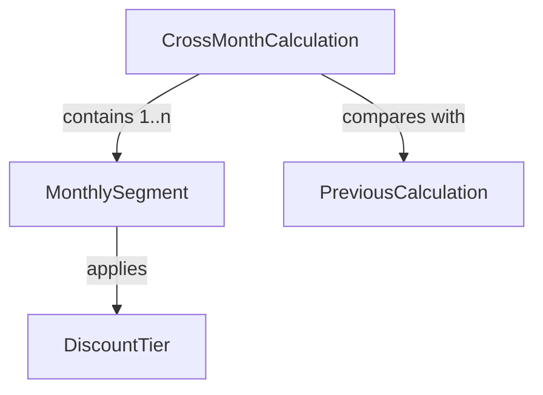
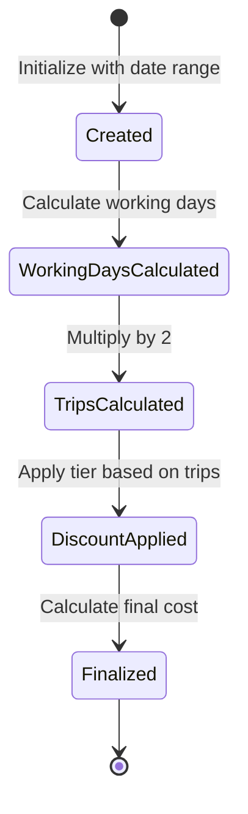
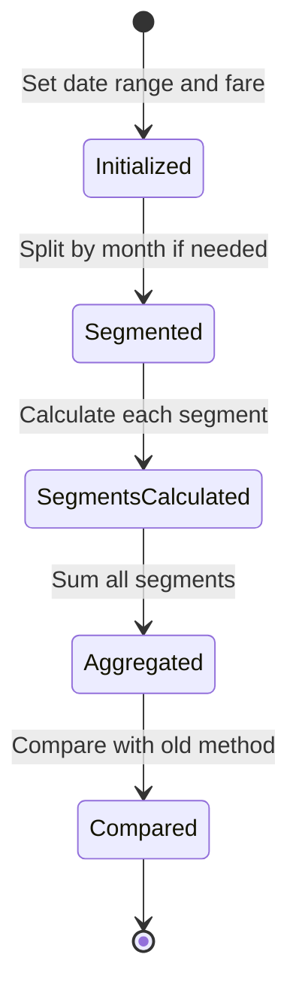

# Data Model: Cross-Month TPASS Calculation

**Feature**: Cross-Month TPASS Calculation
**Date**: 2025-11-02

## Core Entities

### MonthlySegment

Represents a portion of the 30-day period within a single calendar month.

```typescript
interface MonthlySegment {
  // Calendar month information
  year: number;              // e.g., 2025
  month: number;             // 0-11 (JavaScript month index)
  monthName: string;         // e.g., "October", "November"

  // Date range within this month
  startDate: Date;           // First day of segment in this month
  endDate: Date;             // Last day of segment in this month

  // Calculation data
  workingDays: number;       // Number of working days in this segment
  trips: number;             // workingDays * 2 (round trip)
  baseFare: number;          // Single trip fare amount

  // Discount application
  discountTier: number;      // 0, 10, 15, or 20 (percentage)
  discountAmount: number;    // Amount saved due to discount

  // Costs
  originalCost: number;      // trips * baseFare (before discount)
  finalCost: number;         // originalCost - discountAmount
}
```

**Validation Rules**:
- startDate must be <= endDate
- startDate and endDate must be in the same calendar month
- workingDays >= 0
- trips = workingDays * 2
- discountTier must be one of: 0, 10, 15, 20
- finalCost = originalCost * (1 - discountTier/100)

### CrossMonthCalculation

Represents the complete calculation result for a cross-month TPASS period.

```typescript
interface CrossMonthCalculation {
  // Input parameters
  startDate: Date;           // Start of 30-day period
  endDate: Date;             // End of 30-day period (startDate + 29 days)
  farePerTrip: number;       // Base fare amount

  // Calculation metadata
  totalDays: number;         // Always 30 for TPASS
  totalWorkingDays: number;  // Sum of working days across all segments
  totalTrips: number;        // totalWorkingDays * 2

  // Month breakdown
  crossesMonthBoundary: boolean;  // true if spans multiple months
  segments: MonthlySegment[];     // 1-3 segments typically

  // Financial summary
  totalOriginalCost: number;      // Sum of segments' original costs
  totalDiscountAmount: number;    // Sum of segments' discount amounts
  totalFinalCost: number;         // Sum of segments' final costs

  // Comparison with old calculation
  previousCalculation?: {
    method: 'single-discount';    // Old method name
    totalCost: number;            // What old calculation would return
    difference: number;           // New - Old (can be positive or negative)
  };
}
```

**Validation Rules**:
- endDate = startDate + 29 days
- segments.length >= 1
- If crossesMonthBoundary = false, then segments.length = 1
- totalWorkingDays = sum of all segments' workingDays
- totalFinalCost = sum of all segments' finalCost

### DiscountTier

Represents the TPASS discount structure.

```typescript
interface DiscountTier {
  minTrips: number;        // Minimum trips for this tier (inclusive)
  maxTrips: number | null; // Maximum trips for this tier (inclusive), null = unlimited
  discountPercent: number; // Discount percentage (0, 10, 15, or 20)
  description: string;     // Human-readable description
}

// Static configuration
const DISCOUNT_TIERS: DiscountTier[] = [
  { minTrips: 1,  maxTrips: 30,   discountPercent: 0,  description: "No discount" },
  { minTrips: 31, maxTrips: 40,   discountPercent: 10, description: "10% off" },
  { minTrips: 41, maxTrips: 50,   discountPercent: 15, description: "15% off" },
  { minTrips: 51, maxTrips: null, discountPercent: 20, description: "20% off" }
];
```

## Relationships



## State Transitions

### MonthlySegment State Flow



### CrossMonthCalculation State Flow



## Data Flow

1. **Input**: Start date, fare amount
2. **Detection**: Check if 30-day period crosses month boundary
3. **Segmentation**: Split date range into monthly segments
4. **Calculation**: For each segment:
   - Count working days
   - Calculate trips (days × 2)
   - Determine discount tier
   - Apply discount
5. **Aggregation**: Sum all segment costs
6. **Comparison**: Calculate difference from old method
7. **Output**: Complete calculation with breakdown

## Example Data

### Single Month (No Boundary Crossing)

```json
{
  "startDate": "2025-11-05",
  "endDate": "2025-12-04",
  "farePerTrip": 35,
  "crossesMonthBoundary": false,
  "segments": [{
    "year": 2025,
    "month": 10,
    "monthName": "November",
    "workingDays": 22,
    "trips": 44,
    "discountTier": 15,
    "originalCost": 1540,
    "finalCost": 1309
  }],
  "totalFinalCost": 1309
}
```

### Cross-Month Example

```json
{
  "startDate": "2025-10-31",
  "endDate": "2025-11-29",
  "farePerTrip": 35,
  "crossesMonthBoundary": true,
  "segments": [
    {
      "year": 2025,
      "month": 9,
      "monthName": "October",
      "workingDays": 1,
      "trips": 2,
      "discountTier": 0,
      "originalCost": 70,
      "finalCost": 70
    },
    {
      "year": 2025,
      "month": 10,
      "monthName": "November",
      "workingDays": 19,
      "trips": 38,
      "discountTier": 10,
      "originalCost": 1330,
      "finalCost": 1197
    }
  ],
  "totalFinalCost": 1267
}
```