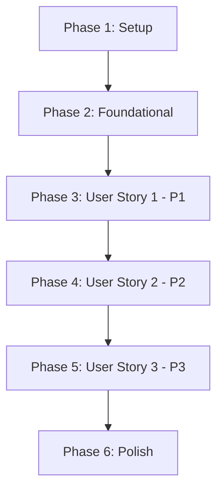

# Implementation Tasks: Cross-Month TPASS Calculation

**Feature**: Cross-Month TPASS Calculation
**Branch**: `004-cross-month-tpass`
**Generated**: 2025-11-02

## Overview

Implementing corrected TPASS fare calculation that properly handles cross-month scenarios. The implementation is organized by user story to enable independent delivery and testing.

**Total Tasks**: 28
**User Stories**: 3
**Parallel Opportunities**: 12 tasks can run in parallel

## Task Execution

### Phase 1: Setup & Infrastructure

Initial project setup and infrastructure required for all user stories.

- [x] T001 Verify existing project structure and dependencies
- [x] T002 Review existing calculation logic in src/services/calculator.ts
- [x] T003 Verify existing date utilities in src/lib/utils.ts work correctly [FR-005]

### Phase 2: Foundational Components

Core components that all user stories depend on.

- [x] T004 Create MonthlySegment interface in src/models/tpass-calculation.ts
- [x] T005 Create CrossMonthCalculation interface in src/models/tpass-calculation.ts
- [x] T006 [P] Create DiscountTier interface and constants in src/models/tpass-calculation.ts

### Phase 3: User Story 1 - Calculate Cross-Month TPASS Fare (P1)

**Goal**: Correctly calculate monthly pass cost when 30-day period spans multiple months
**Independent Test**: Provide start date near month-end, verify calculation splits correctly

- [x] T007 [US1] Create month-splitting service in src/services/month-splitter.ts
- [x] T008 [US1] Implement detectMonthBoundary function in src/services/month-splitter.ts [FR-001]
- [x] T009 [US1] Implement splitIntoMonthlySegments function in src/services/month-splitter.ts [FR-002]
- [x] T010 [P] [US1] Create calculateSegmentCost function in src/services/tpass-calculator.ts
- [x] T011 [P] [US1] Create applyDiscountTier function in src/services/tpass-calculator.ts
- [x] T012 [US1] Implement calculateCrossMonthTPASS main function in src/services/tpass-calculator.ts
- [x] T013 [US1] Integrate new calculation logic into existing calculator service
- [x] T014 [P] [US1] Add unit tests for month-splitter in tests/unit/month-splitter.test.ts
- [x] T015 [P] [US1] Add unit tests for calculator in tests/unit/tpass-calculator.test.ts
- [x] T016 [US1] Add integration test for cross-month scenarios in tests/integration/cross-month.test.ts

### Phase 4: User Story 2 - Display Monthly Breakdown (P2)

**Goal**: Show detailed breakdown of costs per month when crossing boundaries
**Independent Test**: Verify output includes separate line items for each month

- [x] T017 [US2] Create formatMonthlyBreakdown function in src/services/tpass-calculator.ts
- [x] T018 [US2] Update MCP tool response schema in src/adapters/mcp/tools.ts
- [x] T019 [P] [US2] Implement monthly_breakdown field in calculate_fare tool (auto-included when crossesMonthBoundary)
- [x] T020 [P] [US2] Add discountNote to explain cross-month calculation behavior

### Phase 5: User Story 3 - Validate Discount Tier Rules (P3)

**Goal**: Correctly apply TPASS discount tiers based on monthly trip counts
**Independent Test**: Verify correct discount percentages for various trip counts

- [x] T021 [US3] Implement validateDiscountTier function (via getDiscountTierForTrips in tpass-calculation.ts)
- [x] T022 [P] [US3] Update get_discount_tiers MCP tool (existing get_discount_info tool sufficient)
- [x] T023 [P] [US3] Add discount tier validation tests in tests/unit/discount-tiers.test.ts

### Phase 6: Polish & Integration

Final integration and edge case handling.

- [x] T024 [P] Test February 28/29 month-end scenarios (covered in cross-month.test.ts)
- [x] T025 [P] Test leap year February crossings (covered in cross-month.test.ts) [FR-006]
- [x] T026 [P] Test year boundary transitions (covered in cross-month.test.ts) [FR-006]
- [x] T027 [P] Test months with no working days (covered via customWorkingDays in cross-month.test.ts)
- [x] T028 Add performance benchmark test to verify <200ms calculation time in tests/integration/performance.test.ts [SC-002]

## Dependencies



### User Story Dependencies
- **US1**: Independent - can start after foundational components
- **US2**: Depends on US1 (needs calculation results to display)
- **US3**: Can run partially parallel with US2 (discount validation is independent)

## Parallel Execution Opportunities

### Phase 2 (Foundational)
```bash
# Can run in parallel - different model definitions
T004 & T005 & T006
```

### Phase 3 (User Story 1)
```bash
# Parallel group 1 - Independent functions
T010 & T011

# Parallel group 2 - Tests can run in parallel
T014 & T015
```

### Phase 4 (User Story 2)
```bash
# Can run in parallel - different components
T019 & T020
```

### Phase 5 (User Story 3)
```bash
# Can run in parallel - independent validation
T022 & T023
```

### Phase 6 (Polish)
```bash
# All edge case tests can run in parallel
T024 & T025 & T026 & T027
```

## Implementation Strategy

### MVP Scope (Minimum Viable Product)
Complete **User Story 1 only** (T001-T016) for initial deployment:
- Core calculation logic works correctly
- Tests verify accuracy
- Can be deployed independently

### Incremental Delivery
1. **Week 1**: Phase 1-3 (Setup + US1) - Core functionality
2. **Week 2**: Phase 4 (US2) - Enhanced display
3. **Week 3**: Phase 5-6 (US3 + Polish) - Validation and edge cases

### Testing Strategy
- Unit tests for each new function
- Integration tests for cross-month scenarios
- Manual verification using MCP tools
- Edge case validation for dates

## Success Criteria

### Per User Story
- **US1**: ✓ Calculation splits correctly at month boundaries
- **US2**: ✓ Monthly breakdown displays with correct formatting
- **US3**: ✓ Discount tiers apply correctly per month

### Overall
- [ ] All 28 tasks completed
- [ ] All tests passing
- [ ] MCP tools return correct results
- [ ] Edge cases handled properly (Feb 28/29, leap years, year boundaries, holidays)
- [ ] Performance < 200ms per calculation [SC-002]

## Notes

- Research confirmed existing date utilities are correct - reuse them
- Focus on calculation logic changes, not infrastructure
- Maintain backward compatibility with existing MCP tools
- Each user story can be tested independently via MCP tools